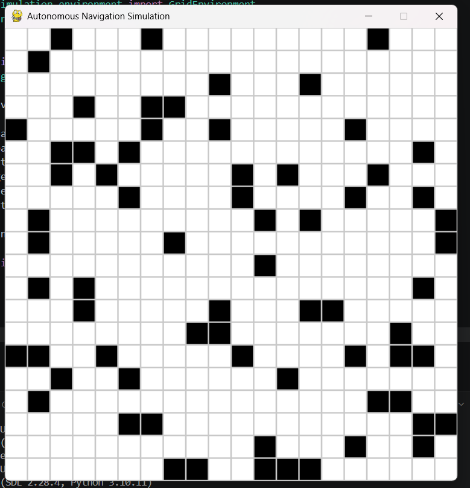

# 🚀 AI-Based Autonomous Navigation System

## 📌 Overview

This project simulates an autonomous navigation system where an agent finds the shortest path while avoiding obstacles using the A* algorithm.

---

## 🎯 Features

* Interactive grid simulation
* A* path planning algorithm
* Real-time obstacle drawing
* Step-by-step robot movement
* Start and goal selection
* Screenshot capture

---
# 🚗 AI Autonomous Navigation System

This project simulates an autonomous agent navigating a grid environment using the A* pathfinding algorithm.

## 🔍 Features
- A* pathfinding algorithm
- Dynamic obstacle avoidance
- Real-time visualization using Pygame
- Grid-based simulation

## 🧠 Algorithm
The system uses the A* (A-star) algorithm with heuristic optimization to find the shortest path from start to goal.

## 📸 Simulation Preview



## ⚙️ Installation

```bash
pip install -r requirements.txt

## 🧠 How It Works!

The system simulates an autonomous agent navigating a grid environment.

- The environment is defined in `simulation/environment.py`
- Navigation logic is handled in `src/navigation`
- Path planning algorithms are implemented in `src/path_planning`

The agent moves from a start position to a goal while avoiding obstacles.

## 🛠 Tech Stack

* Python
* Pygame
* NumPy

---

## 🎮 Controls

* Left Click → Set Start
* Right Click → Set Goal
* Middle Click → Draw Obstacles
* R → Reset
* S → Save Screenshot


## 🧠 Concepts Used

* Path Planning (A*)
* Graph Algorithms
* Autonomous Navigation
* Simulation Systems

---

## 📌 Future Scope

* Object detection (YOLO)
* Self-driving simulation (CARLA)
* Reinforcement learning navigation

---

## 👤 Author

Your Name
sinchana 